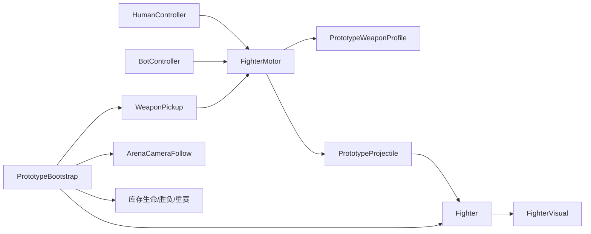

# Prototype 0.1.4 工程交接报告（Claude）

> 交接日期：2026-09-01  
> 工程根目录：`C:\Users\17141\OneDrive\Document\ChatGPT\Game`  
> 文档风格：通用工程交接（security vendor flavor = null）  
> 当前工作流：`BUILD / STANDARD`

## 执行摘要

本工程是一款原创2.5D平台射击派对游戏原型，目标为Steam买断制、2–4人在线对战。当前可运行版本为Prototype 0.1.4：已具备一名玩家对AI、单向平台、二段跳和空中战斗、击退/出界库存生命、完整胜负与重赛、轻量本机玩家镜头，以及三种有限弹药拾取武器。Unity Windows构建、运行烟雾、0.1.4比赛生命周期断言和真实窗口检查均已通过。尚未完成的是主观武器平衡、抓边、屏外方向提示、联网和正式世界观/美术。Claude接手后应先试玩0.1.4并记录可复现反馈，不应直接扩张功能范围。

## 快速开始

### 打开和运行

Unity Hub打开：

```text
game-client/
```

要求使用Unity `6000.5.10f1`。场景为：

```text
game-client/Assets/Scenes/Prototype.unity
```

现有Windows构建：

```powershell
& '.\game-client\Builds\Prototype01\ChaosArenaPrototype.exe'
```

### 编译和构建

```powershell
& .\game-client\Tools\verify-prototype.ps1
& .\game-client\Tools\build-prototype.ps1
```

两个脚本会自动查找：

```text
C:\Program Files\Unity\Hub\Editor\6000.5.10f1\Editor\Unity.exe
```

构建产物位于 `game-client/Builds/Prototype01/`，主要日志位于 `game-client/Logs/`。

### 运行自动烟雾

```powershell
$smokeLog = (Resolve-Path '.\game-client\Logs').Path + '\claude-smoke.log'
& '.\game-client\Builds\Prototype01\ChaosArenaPrototype.exe' `
  -batchmode -nographics -chaosSmokeTest -logFile $smokeLog
Start-Sleep -Seconds 3
Select-String -Path $smokeLog -Pattern 'CHAOS_ARENA|Exception|error CS'
```

预期至少出现：

```text
CHAOS_ARENA_014_ASSERTIONS_PASS
CHAOS_ARENA_SMOKE_READY
CHAOS_ARENA_SMOKE_PASS
```

OneDrive环境有时会让日志落盘稍晚；如果首次读取不存在，等待1–3秒后再读，不要误判为运行失败。

## 玩法与控制

| 操作 | 按键 | 当前行为 |
|---|---|---|
| 移动 | `A/D` 或左右方向键 | 2D平面移动，角色Z轴锁定 |
| 跳跃 | `Space` | 最多二段跳；跳速10.8 |
| 下穿平台 | `S` 或下方向键 | 只穿当前上层单向平台；主地板不可穿 |
| 开火 | `J` 或左Ctrl | 面向方向水平开火；散射枪产生纵向散布 |
| AI难度 | `F1/F2/F3` | Easy/Normal/Hard；默认Easy |
| 重赛 | `R` | 任意时刻重置；结算时开始新局 |

比赛立即开始，没有倒计时。双方各3条库存生命。内部稳定度从100下降到0不会直接死亡，而是把受击倍率从1.0逐渐提高到3.5；只有出界扣命。非最终出界重生后有0.9秒保护。最后一条生命耗尽后，失败者停用、战斗停止、子弹清理并显示胜者。

## 当前武器参数

| 武器 | 弹药 | 冷却 | 弹速 | 单弹内部伤害 | 基础击退 | 备注 |
|---|---:|---:|---:|---:|---|---|
| Carbine | 无限 | 0.32s | 18 | 9 | 3.25 / 1.38 | 默认基础枪 |
| Pulse SMG | 32 | 0.11s | 21 | 3.2 | 1.15 / 0.42 | 青色连续压制 |
| Scatter | 8次 | 0.72s | 15 | 3.5×5 | 每弹1.25 / 0.5 | 粉色、16°散射 |
| Rocket | 5 | 1.05s | 10 | 13×衰减 | 4.4 / 2.1 | 黄色、2.7范围爆炸 |

拾取点固定在左、上、右平台附近，约10秒刷新；拾取武器弹药耗尽后自动回到Carbine。AI只在7.5单位内寻找可用拾取，并按难度概率争夺。

这些数值只通过构建和功能测试，**没有完成人工平衡结论**。重点关注Scatter五弹同时命中和Rocket范围是否导致过快淘汰。

## 架构与文件地图



| 文件 | 责任 | 修改风险 |
|---|---|---|
| `PrototypeBootstrap.cs` | 构建竞技场/角色/拾取点、比赛生命周期、HUD、烟雾断言 | 高；当前文件较大，应在联网前拆分 |
| `Fighter.cs` | 内部稳定度、击退倍率、库存生命、保护、淘汰和重生 | 高；网络权威核心 |
| `FighterMotor.cs` | 移动、跳跃、分阶段重力、单向平台、武器/弹药、开火 | 高；应与输入来源解耦后联网 |
| `BotController.cs` | 难度、战术状态、射击段、平台与拾取决策 | 中 |
| `PrototypeWeaponProfile.cs` | 四把枪的数据配置 | 中；后续宜迁移ScriptableObject |
| `PrototypeProjectile.cs` | 弹体、拖尾、普通命中、散射和火箭范围命中 | 高；联网命中权威核心 |
| `WeaponPickup.cs` | 固定拾取、浮动表现、10秒刷新、AI邻近查询 | 中 |
| `ArenaCameraFollow.cs` | 竞技场锚点和本机玩家轻跟随 | 低 |
| `OneWayPlatform.cs` | 单向平台注册与顶部高度 | 中 |
| `FighterVisual.cs` / `CombatVfx.cs` / `PrototypeAudio.cs` | 原型表现与程序音效 | 低至中 |
| `PrototypeMaterials.cs` | 显式URP Lit/Unlit材质，防止紫色错误 | 高；不要退回默认Primitive材质 |
| `Editor/PrototypeSceneBuilder.cs` | 场景生成、资源材质和Windows构建入口 | 高 |

当前架构由 `PrototypeBootstrap` 运行时创建多数对象，适合快速原型，但不适合直接扩展到正式联网。执行U-007前至少拆出MatchRules、SpawnService、InputSource/Ownership、WeaponService和表现层。

## 镜头与未来多人约束

用户明确否决以两名角色动态中心为主的镜头。当前 `ArenaCameraFollow` 保持平台中心为主，只使用本机玩家位置的小比例偏移：

- 横向贡献约13%，限制在±1.4；
- 纵向贡献约9%，限制在-0.45到+0.65；
- `SmoothDamp`约0.38秒。

未来联网时，每个客户端应只把自己拥有的角色设为目标。仍未实现U-011的本机玩家屏外/出界方向提示。

## 已验证证据、结论与继续路径

### Evidence

| ID | 证据 | 路径/复现 |
|---|---|---|
| E-C01 | Unity 0.1.4 Windows构建成功 | `game-client/Logs/prototype-build.log`；运行build脚本 |
| E-C02 | 0.1.4专项生命周期与烟雾通过 | `game-client/Logs/prototype-0.1.4-smoke.log`；运行上方烟雾命令 |
| E-C03 | 初始窗口显示三个彩色拾取、武器HUD、2.5D材质且无紫色错误 | 2026-09-01本机真实窗口检查；版本说明见 `updates/VERSION_0_1_4.md` |

### Findings

| ID | 状态 | 结论 | 证据 |
|---|---|---|---|
| F-C01 | validated | 工程可在指定Unity版本编译并生成Windows Player | E-C01、E-C02 |
| F-C02 | validated | 三个拾取点、第三次出界淘汰、胜者和重赛恢复逻辑执行通过 | E-C02、源代码断言 |
| F-C03 | candidate | 0.1.4具备可人工试玩的完整单局循环 | E-C02、E-C03；仍缺完整人工对局确认 |
| F-C04 | unknown | 三把武器是否平衡、镜头是否舒适 | 尚无玩家完整试玩证据 |

### Continuation path

1. 运行现有0.1.4并完成至少三局，每局优先使用一种拾取武器——证据：录入具体观察到 `updates/` 或新测试记录。
2. 把可复现问题区分为bug和调参，不从一次主观印象直接重构系统——关联F-C03/F-C04。
3. 修复后重新运行build与专项smoke，并检查真实窗口。
4. 获得用户批准后，再选择U-009抓边或U-011屏外提示组成下一批。
5. 只有用户重新开启U-007时，才从当前官方资料评估网络方案，并先重构权威/所有权边界。

## 已知风险与陷阱

- `PrototypeBootstrap.cs`承担过多职责；继续塞功能会增加重赛、联网和对象生命周期错误。
- 物理基于Unity PhysX，不应假设不同网络客户端可做确定性同步；未来应由Host确认位置、子弹、命中、击退和胜负。
- 火箭范围使用 `Physics.OverlapSphere`，Scatter一次生成5弹丸；密集战斗仍需检查重复命中、性能和视觉噪声。
- 当前火箭不伤害发射者；是否需要自我击退尚未设计。
- 重生保护目前没有明显闪烁/护盾表现，玩家可能误解命中无效。
- 角色淘汰时GameObject停用；未来观战、网络断线和重连需要不同生命周期。
- HUD使用IMGUI，只适合原型；正式UI应迁移到UIToolkit或UGUI。
- 程序生成音效和Primitive模型是临时占位，不代表最终美术方向。
- 不要删除 `Assets/Resources/ChaosArenaMaterials` 或改回默认Primitive材质，否则Windows URP构建可能再次出现整屏紫色。
- 工程在OneDrive目录；日志和文件状态可能有短暂同步延迟。

## 产品与授权边界

- 类型级参考允许：平台移动、击退、出界、拾取和派对混战。
- 禁止公开复用参考Flash游戏的代码、素材、动画、声音、地图、UI、名称或具体表达。
- 当前构建没有提取的Flash素材，也没有第三方美术。
- 网络素材必须记录来源与商业许可，优先CC0/明确可商用免费素材。
- 目标商业模式是小型买断制Steam派对游戏；不是免费抽卡或强度付费。
- 用户约定：新建议先写开发日志，形成足够连贯的版本后获得明确批准再实现。

## 下一步建议

当前不是继续堆功能的时点。Claude应先执行0.1.4完整试玩并给用户一份具体观察清单。若用户确认玩法稳定，下一候选优先级是：

1. U-009：一次清晰、可学习的抓边回场机会；仍需决定自动抓边还是按方向抓边。
2. U-011剩余部分：只为本机玩家显示屏外/出界方向，不做双角色动态镜头。
3. U-007：两人Host/Join；网络技术尚未选择，Steam仍未配置。
4. U-014：独立低重力/月球模式，不修改基础模式物理。

如果Claude只获得文件而没有本机图形会话，应完成静态检查、构建和无头烟雾，但必须把“实际试玩/视觉舒适度”保持为未验证，不能虚报完成。
