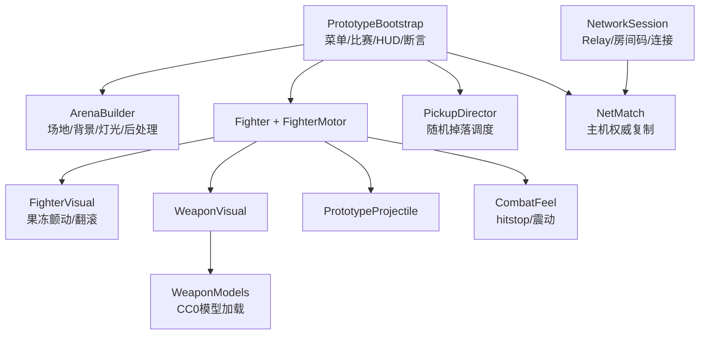

# Prototype 0.2.5 工程交接报告（交给 Codex）

> 交接日期：2026-09-02
> 工程根目录：`C:\Users\17141\OneDrive\Document\ChatGPT\Game`
> 远程仓库：`https://github.com/GhostGrago/chaos-arena-prototype`（**public**）
> 上一份交接：`docs/2026-09-01_工程交接-Claude-report.md`（Prototype 0.1.4）

## 执行摘要

本工程是一款原创 2.5D 平台射击派对游戏原型，目标为 Steam 买断制、2–4 人在线对战。

自 0.1.4 交接以来，工程从"单机对 AI 的手感原型"推进到**可实际联机对战的版本**：确定了美术身份（几何战士 / 果冻质感）、修复了两个长期潜伏的严重缺陷、接入了 Netcode for GameObjects + Unity Relay 的主机/加入，并完成了两轮美术迭代。

**当前状态是可玩、可联机、已由用户实机验收的。** 未完成的主要是客户端预测、等待室、以及多种游戏模式。

## 快速开始

```powershell
& .\game-client\Tools\verify-prototype.ps1
& .\game-client\Tools\build-prototype.ps1
& '.\game-client\Builds\Prototype01\ChaosArenaPrototype.exe'
```

无头烟雾测试：

```powershell
$log = (Resolve-Path '.\game-client\Logs').Path + '\smoke.log'
& '.\game-client\Builds\Prototype01\ChaosArenaPrototype.exe' -batchmode -nographics -chaosSmokeTest -logFile $log
Start-Sleep -Seconds 5
Select-String -Path $log -Pattern 'CHAOS_ARENA|Exception'
```

预期出现 `CHAOS_ARENA_023_ASSERTIONS_PASS`、`CHAOS_ARENA_SMOKE_READY`、`CHAOS_ARENA_SMOKE_PASS`。

对外发布用的非开发构建：

```powershell
# executeMethod: ChaosArena.Editor.PrototypeSceneBuilder.BuildWindowsRelease
# 输出到 Builds/Prototype01-Release/，不覆盖烟雾测试用的开发构建
```

## 已确定的产品身份

**几何战士 / Geometry Fighters**（工作名），基础模式称"几何角斗场"。决策与理由见 `DECISIONS.md` D-019 与 `GAME_VISION.md`。

- 角色是**基本立体**：立方体 / 球体 / 四面体 / 圆柱体，各自配色，带一个发光"眼"指示朝向。
- **果冻质感**：半透明材质 + 弹簧颤动。
- 抛弃了原先三个叙事型世界观备选。核心理由：项目要承载多种规则完全不同的模式（生化、转盘、逃杀），叙事型设定会要求每个模式在故事里自圆其说；抽象几何没有这个包袱，且与"全程序化 primitive"的工程现状完全对齐。

⚠️ **抄袭边界**：果冻**人形**会撞 Fall Guys（派对游戏 + 果冻小人已被其占据），果冻**几何体**不会。风险在剪影，不在材质。改角色造型时请守住这条。

## 架构地图



| 文件 | 责任 | 修改风险 |
|---|---|---|
| `PrototypeBootstrap.cs` | 菜单、比赛生命周期、座位、HUD、烟雾断言 | **高，且仍然过大**。加新模式前应先抽出模式框架（U-028） |
| `NetworkSession.cs` | UGS 登录、Relay 分配、房间码、Host/Join | 高 |
| `NetMatch.cs` | 主机权威状态广播、客户端输入上行、座位分配 | 高 |
| `ArenaBuilder.cs` | 场地、背景、灯光、后处理，数据驱动的平台布局 | 中 |
| `PickupDirector.cs` | 随机掉落的时间/位置/武器 | 低 |
| `FighterMotor.cs` | 移动、跳跃、受击硬直、开火、远端表现状态 | 高 |
| `Fighter.cs` | 稳定度、击退倍率、库存生命、保护、碎裂 | 高 |
| `PrototypeMaterials.cs` | 全部材质路径（Lit/Unlit/Jelly/Neon/Textured/Panel/共享） | **高，见下方 URP 陷阱** |
| `WeaponModels.cs` | CC0 武器模型加载、每模型枪口方向 | 低 |

## 联机设计

**技术选型**：Netcode for GameObjects 2.13.2 + Unity Transport 2.7.4 + Unity Relay 1.2.0。

**为什么用 Relay 而非直连**：主机在 NAT 之后，直连需要端口转发，而 `GAME_VISION.md` 明确将其排除在默认体验之外，家宽 CGNAT 下端口转发也无效。Relay 用房间码穿透。

**为什么不是逐角色 NetworkObject**：场地与角色全部运行时生成，无法作为网络 Prefab。复制集中在**唯一一个 `NetMatch`** 上：客户端上报输入，主机以 25Hz 广播全部 4 个角色状态 + 比赛状态 + 掉落状态。

⚠️ **`NetMatch` 必须是注册的 Prefab 由主机生成，不能是场景内对象。** `EnableSceneManagement = false` 时 NGO 不会把场景内 NetworkObject 标记为"客户端已有"，会按动态生成广播，客户端因找不到 Prefab 而失败（实际踩过）。

**权威划分**：主机跑物理、AI、出界、胜负、掉落；客户端纯表现，本地刚体转 kinematic，直接套用收到的状态。

**成本**：Relay 免费额度为 50 average CCU（约 216 万连接分钟/月）+ 150 GiB/月。本项目试玩规模用量约为额度的 1%，远未触及收费。长期建议在上架时切换到 Steam 网络（对已上架游戏免费），届时只需换 Transport，不用重写游戏逻辑。

## 已修复的重要缺陷（务必不要改回去）

### 1. 弹丸出膛即自毁（0.1.5）

`CombatVfx` 用 `Destroy(collider)` 删特效碰撞体，但 **Unity 的 `Destroy` 要到本帧结束才生效**。枪口火花与刚生成的弹丸位置重合，弹丸触发器立刻撞上它并自毁。表现为"有火花但没子弹、打不中人"。

**规则：任何装饰性 primitive 都必须先 `collider.enabled = false` 再 `Destroy`。** 已有断言 `AssertProjectileSurvivesItsOwnMuzzleFlash` 守住。

### 2. 击退被移动控制抵消（0.1.11）

`FighterMotor` 每个物理步直接覆盖水平速度，地面加速度 35/秒会在约 0.09 秒内把 3.25 的击退冲量完全抹掉。`AddForce` 执行了，下一步就被覆盖。

**修法是受击硬直**：命中后 0.15–0.45 秒（按冲量缩放）挂起移动控制，期间只有轻微阻力。**改动 `FighterMotor` 移动逻辑时必须保留这个控制锁**，否则击退会再次失效。

### 3. 运行时切换 URP 材质为透明会静默失败（0.1.10）

代码里写 `_Surface`、`_SrcBlend`、`_ZWrite` 并开关键字**没有报错也没有生效**，果冻角色一直是不透明的，而烟雾测试当时是通过的（它没检查透明度）。

**规则：URP 材质状态不要在代码里猜，做成 Resources 材质资产。** `PrototypeJelly.mat` 就是为此存在。断言现在直接检查 `renderQueue` 与 `_SURFACE_TYPE_TRANSPARENT` 关键字。

### 4. 断线检测踢掉正在连接的客户端（0.2.3）

`StartClient()` 在连接批准完成**之前**就返回，下一帧检查 `IsConnectedClient` 仍为 false，于是判定掉线并 `Shutdown()`。表现为"加入不了"且日志无异常。

**修法**：只有在**确实连上过**之后再断开才算掉线。

## 第三方素材

三份全部 CC0，登记在 `docs/archive/ASSET_POLICY.md` 的 TP-001~TP-003，许可证副本随资产存放。

| ID | 内容 | 来源 |
|---|---|---|
| TP-001 | 武器模型 | Kenney Blaster Kit |
| TP-002 | 平台贴图 | ambientCG MetalPlates006 |
| TP-003 | 背景建筑 | Kenney City Kit (Commercial) |

⚠️ **仓库现在是 public。** 以后任何提交都是立即公开的，Steam/联网的密钥、账号、服务配置必须走 `.gitignore` 或环境变量。仓库无 LICENSE 文件，默认"保留所有权利"，这是商业项目的保守默认值，**不要随手加开源许可证**。

## 未完成项（优先级见 `updates/CANDIDATES.md`）

| ID | 内容 | 阻塞点 |
|---|---|---|
| U-030 | 客户端预测 | 当前客户端有一个来回的输入延迟，实测可感知。⚠️ 预测需输入重放与状态回滚，易引入抖动，应单独一批 |
| U-029 | 联机等待室 | 现在房主开房即进对局，他人中途加入会触发重开 |
| U-028 | 模式框架 | **做第二个模式之前必须先抽出**，否则每加一个模式都要改 `PrototypeBootstrap` |
| U-009 | 抓边回场 | 0.1.7 实现过、0.1.8 撤回。⚠️ 重做前必须先给 AI 加挂边感知，否则人机会卡在边缘反复抓放 |
| U-024/025/026/027 | 生化 / 转盘 / 逃杀 / 强力武器模式 | 依赖 U-028 |
| U-015 | 散射贴脸过强 | 5 弹齐中，尚未在新地图重测 |

## 协作约定

- **本地文件是唯一事实来源**，云端只是版本记录，推送前看一下改动文件即可，不必深入排查 GitHub。
- Codex 与 Claude **不会同时工作**（一方上传时另一方休息），因此不需要处理并发冲突；**谁改完谁提交**。
- 新需求默认先记入 `updates/CANDIDATES.md` 攒批，由助手判断何时组成连贯版本。
- **批准规则**：修 bug、调数值、用户已明确提过的需求 → 直接做完再报告；新玩法、改设计方向、助手自己提出的功能 → 先列清单等用户点头。
- 每批固定流程：改代码 → Unity 构建 → `-chaosSmokeTest` → 同步更新 `PROJECT_STATE.md` / `NEXT_TASKS.md` / `updates/VERSION_*.md` / `CANDIDATES.md` → 提交、打 `v0.x.y` 标签、推送。
- **构建通过和烟雾通过不等于手感通过。** 本工程已有多次"测试通过但功能实际不工作"的先例（见上文缺陷 1 和 3），涉及表现层的改动必须由真人确认。
